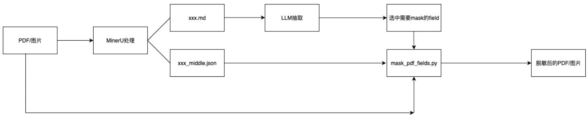

# 使⽤说明

# 流程图

# mineru使⽤

安装

pip install uv -i https://mirrors.aliyun.com/pypi/simple uv pip install -e .[core] -i https://mirrors.aliyun.com/pypi/simple

使⽤：命令⾏输⼊

mineru -p (待识别的⽂件存放的⽂件夹) -o （存放结果的⽂件夹）

识别完成后，每个⽂件对应⼀个⽂件夹，分别存放markdown⽂件（⽤于抽取）和middle.json（⽤于待脱敏字段的定位）

# mask_pdf_fields.py

功能：接受需要脱敏的字段、原⽂件路径、middle.json，返回脱敏后的⽂件具体⽤法⻅代码末尾示例